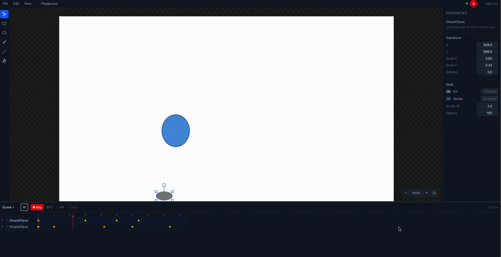

# Inamate

> The fastest way to animate expressive 2D characters and motion using a timeline + vector stage, without fighting the tool.

<p align="center">
  
</p>

Inamate is an open-source, collaborative, timeline-centric 2D animation platform built for the web. Our goal is to combine the simplicity of classic animation tools with modern, powerful features, focusing on speed and an animation-first user experience.

Built with a Go backend, a Go-based WebAssembly (WASM) core engine, and a TypeScript/React frontend.

## Features

- **Real-time Collaborative Editing** - Work together with your team in real-time
- **Timeline-Centric Workflow** - Keyframe animation with property tracks and easing
- **Vector Graphics Engine** - Create and animate shapes directly on canvas
- **WebAssembly Performance** - Native-speed rendering powered by Go/WASM
- **Instant Playback** - Preview your animations at full framerate

## Core Principles

- **Fast:** Get from a blank canvas to a moving character in minutes, not hours.
- **Clear:** Simple scenes feel simple. Complex scenes stay navigable and performant.
- **Approachable Power:** Features like rigging are designed as optional tools for posing, not mandatory engineering exercises.
- **Animation First:** The user experience prioritizes timing, posing, and iteration over complex technical setup.

---

## Roadmap

This project is developed in phases, with each phase building on the last.

### Phase 1: MVP (The Foundation) - *In Progress*

*Goal: A solo animator can create and export a complete short animation.*

- [x] Core vector drawing engine
- [x] Timeline with layers and keyframes
- [x] Transform animations (position, scale, rotation)
- [x] Real-time collaboration via WebSocket
- [ ] Onion skinning
- [ ] Editable easing curves
- [ ] Mask layers
- [ ] Export to PNG sequence and MP4 video

### Phase 2: Character Animation

*Goal: Make Inamate a compelling choice for character animators.*

- Approachable Rigging: Bones (FK/IK), auto-weighting, and visual controls
- Switch/Pose Layers: For managing mouths, hands, and expressions
- Graph Editor: Fine-grained control over animation curves and timing

### Phase 3: Power & Scale

*Goal: Unlock advanced workflows without overwhelming new users.*

- Deformation System: Envelope, curve, and mesh deformers
- Driver System: Allow any property to drive any other property for smart rigs
- Non-destructive Effects Stack: Layer-based blurs, glows, and color adjustments

### Phase 4: The "Beautiful Final Form"

*Goal: Solidify Inamate as a professional-grade, extensible tool.*

- Optional Node Graph: For complex rigging and compositing
- Asset & Library System: Reusable, versioned assets
- Modern Publishing: Engine-friendly exports and open interchange formats

---

## Getting Started

### Prerequisites

- [Go](https://go.dev/doc/install) (1.21+)
- [Node.js](https://nodejs.org/en) (LTS)
- [Docker](https://www.docker.com/get-started/)
- [Task](https://taskfile.dev/installation/)

### Quick Start

```sh
# Clone and setup
git clone https://github.com/your-username/inamate.git
cd inamate
task setup

# Start development servers
task dev
```

- **Frontend:** http://localhost:5173
- **Backend API:** http://localhost:8080

### Commands

| Command | Description |
|---------|-------------|
| `task dev` | Start frontend and backend dev servers |
| `task build` | Build all artifacts (WASM, backend, frontend) |
| `task test` | Run all tests |
| `task migrate:up` | Apply database migrations |
| `task infra:stop` | Stop Docker services |

## Tech Stack

| Layer | Technology |
|-------|------------|
| Frontend | TypeScript, React, Vite |
| Backend | Go |
| Core Engine | Go compiled to WebAssembly |
| Database | PostgreSQL |
| Real-time | WebSocket |
| Infrastructure | Docker, Task |

## Contributing

We welcome contributions! Please check the [issues](../../issues) tab to find areas where you can help. For new features or significant changes, please open a discussion first to outline your idea.

## License

[MIT](LICENSE)
